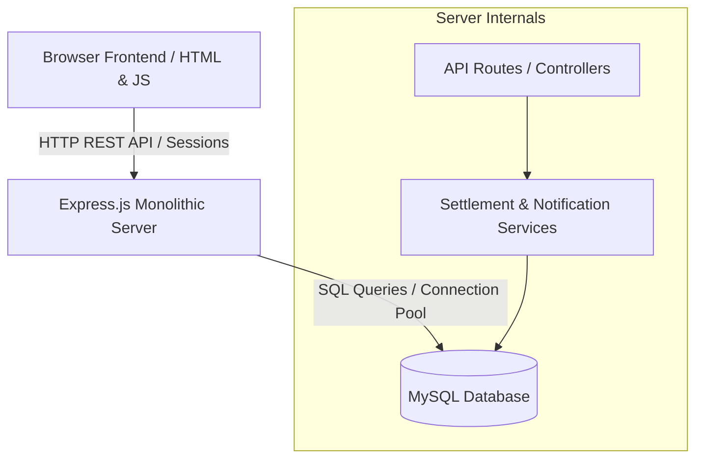
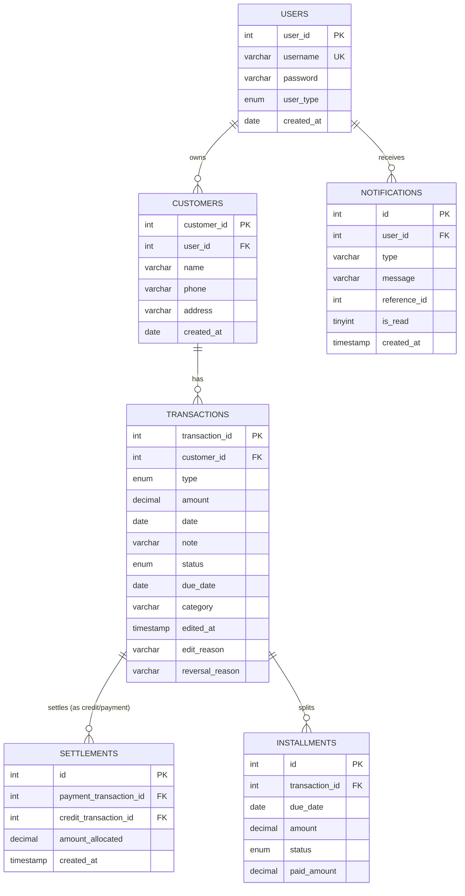

# MiniKhata: Architectural Code Review & Mentorship Report

This document presents a deep-dive, professional architectural analysis of the **MiniKhata** multiuser digital ledger application. It covers database design, settlement engines, data isolation, security, and performance characteristics, contrasting current implementations with industry standards.

---

## 1. Overall Project Analysis

### Software Architecture Pattern
MiniKhata is built using a **Monolithic Client-Server Architecture** with a multi-page routing structure. The backend operates on an **Express.js MVC-style router layer** (though lacking separate controller classes) communicating with a relational MySQL database. 



### System Categorization: CRUD vs. Financial Ledger
While simple digital ledgers resemble CRUD systems (Create, Read, Update, Delete), MiniKhata behaves more like an **Event-Driven Account Ledger System with FIFO Reconciliation**. 
* **Pure CRUD** systems treat data as static records (e.g., updating a profile).
* **Ledgers** treat data as a sequence of immutable or stateful financial events where the *current balance* is a derived value calculated by summing transaction entries over time. 
MiniKhata sits in between: it allows transaction edits and soft-reversals, but its core state is derived via a transactional calculation engine (recalculating settlements and installments dynamically).

### Complexity and Distinction from Student Projects
Most student database projects are simple wrappers around SQL tables with raw `SELECT *` and `INSERT` statements. MiniKhata stands out through several advanced engineering practices:
1. **Dynamic Terminology Adaptation**: The database stores raw business terms (`credit`, `payment`), while the frontend dynamically re-maps these based on the `user_type` ENUM (`personal` vs `business`).
2. **Reconciliation Engine**: The implementation of a First-In-First-Out (FIFO) settlement engine that automatically matches incoming payments against outstanding credits.
3. **Database-Level Transaction Blocks**: Rather than letting Node.js handle database consistency step-by-step, critical endpoints use explicit transactions (`conn.beginTransaction()`) to guarantee atomicity.
4. **Isolated Logical Multi-tenancy**: The database is structured to support multiple users, using database constraints and cascading deletes to wipe customer data when accounts are closed.

---

## 2. Database Analysis

Let's review the SQL schema in [database.sql](file:///d:/project_minikhata/database.sql):



### Normalization Quality
The database is normalized to **Third Normal Form (3NF)**:
* **1NF**: All table columns contain atomic values, and each record is unique.
* **2NF**: It has no partial dependencies (all non-key columns depend entirely on the primary key).
* **3NF**: There are no transitive dependencies. For example, `transactions` stores the `customer_id` but not the customer's phone or address, which prevents data redundancy. 

### Financial Consistency & Numeric Precision
A major strength is the use of `DECIMAL(10,2)` for financial fields (`amount`, `amount_allocated`, `paid_amount`). 
> [!IMPORTANT]
> **Never use `FLOAT` or `DOUBLE` for financial data.** Floating-point types use binary representations (IEEE 754) which introduce rounding errors (e.g., `0.1 + 0.2 = 0.30000000000000004`). `DECIMAL` stores numbers as strings or fixed-point representations, guaranteeing exact math.

### Indexing Strategy
The index definitions in `transactions` are highly deliberate:
* `INDEX idx_txn_customer_status (customer_id, status)`: Speeds up customer-specific transactions lookup.
* `INDEX idx_txn_date_status (date, status)`: Speeds up reporting queries and chronological dashboards.
* `INDEX idx_settlement_payment` and `idx_settlement_credit` in `settlements`: Essential for matching and deletion cascades during settlement recalculation.

#### Database Weaknesses & Missing Constraints
1. **Lack of DB-Level Check Constraints**: While Express checks that amount is positive (`amount > 0`), the database does not enforce it. A negative value could bypass validation and corrupt calculations.
   * *Fix*: Add `CHECK (amount > 0)` to `transactions`, `settlements`, and `installments`.
2. **Cascading Deletes Danger**: `ON DELETE CASCADE` is set on foreign keys. In a real fintech application, deleting a customer or transaction must *never* permanently delete historical ledger records. Financial auditing requires that records be kept indefinitely.
   * *Fix*: Use soft deletion (e.g. `deleted_at` column) or restrict deletions (`ON DELETE RESTRICT`) to prevent accidental wiping.

---

## 3. Backend Architecture Analysis

### Current Architecture Pattern
The backend is an **Express-based Routing Architecture**. While it separates routes into files like [transactions.js](file:///d:/project_minikhata/routes/transactions.js) and [customers.js](file:///d:/project_minikhata/routes/customers.js), it mixes **Routing/HTTP Handling, Business Logic, and Database Queries** in the same files.

### Separation of Concerns (SoC) Evaluation
In a professional codebase, routes should only handle request parsing and response delivery. The current setup suffers from high coupling:

| Layer | Responsibility | Current Code Location | Professional Practice |
| :--- | :--- | :--- | :--- |
| **Controller** | Handle HTTP request, parse body/params, return JSON response | Written inside `routes/*.js` | Kept in a separate `controllers/` directory |
| **Service** | Core business logic, calculating balances, enforcing business rules | Partially in `services/`, partially in `routes/*.js` | Centralized in `services/` |
| **Repository/DAO** | Write/Execute SQL queries directly | Inline `db.query()` calls inside routes | Abstracted into `repositories/` |

### How Scalability Behaves
* **I/O Bound Scaling**: Node.js handles async database I/O efficiently, so basic CRUD operations scale well under low CPU usage.
* **Database Connection Bottleneck**: The connection pool limit is hardcoded to `10` in [db.js](file:///d:/project_minikhata/db.js). Under high traffic, API requests will wait for db connections, leading to latency spikes.
* **CPU-Bound Settlement Recalculation**: Running a complete FIFO recalculation inside Node memory (discussed below) will cause garbage collection spikes and block the event loop if a single customer has thousands of transactions.

---

## 4. FIFO Settlement Engine Analysis

### The Settlement Algorithm in Detail
The FIFO (First-In-First-Out) engine in [settlementEngine.js](file:///d:/project_minikhata/services/settlementEngine.js) resolves how payments match against credit records.

```
Incoming Payments (FIFO ordered)           Outstanding Credits (FIFO ordered)
  [ Payment A: ₹800 ]   --------------->     [ Credit 1: ₹2400 ] (Remaining: ₹1600)
                                            
  [ Payment B: ₹1200 ]  -----[₹1200]--->     [ Credit 1: ₹2400 ] (Remaining: ₹400)
                        
  [ Payment C: ₹1000 ]  -----[₹400]---->     [ Credit 1: ₹2400 ] (Fully Settled!)
                        `----[₹600]---->     [ Credit 2: ₹1500 ] (Remaining: ₹900)
```

#### Steps:
1. **Wipe Existing Settlements**: Drops all rows in `settlements` matching the customer's transactions.
2. **Fetch Chronological Lists**: Selects all non-reversed payments and credits ordered by `date ASC, transaction_id ASC`.
3. **Double-Pointer Matching Loop**: Iterates through payments, matching and subtracting their value against the first available credit with a remaining balance.
4. **Bulk Insert**: Inserts the matches back into the `settlements` table.
5. **Installment Cascade**: Distributes the allocated amount across any active installment plan.

### Core Flaws and Edge Cases
1. **Inefficient O(N * M) Recalculation**: Wiping and recalculating the entire history for a customer is simple, but computationally expensive. If a customer has 5,000 transactions over 3 years, adding one new transaction forces the DB to drop and re-insert thousands of rows.
2. **Transaction Time Ordering Edge Case**: The engine queries transactions ordered by `date ASC, transaction_id ASC`. If a user retroactively adds a transaction with a past date, the engine will recalculate historical settlements. This can alter old reports and confuse users.
3. **Double-spending Race Conditions**: Because database updates happen concurrently, if a customer makes two payments at the same time, the server might read the same unsettled credits for both requests, resulting in duplicate allocations.
   * *Fix*: Execute a row-level lock on the customer using `SELECT * FROM customers WHERE customer_id = ? FOR UPDATE` at the start of the transaction.

---

## 5. Installment System Analysis

### Modeling and Reconciliation
The `installments` table splits a single credit transaction into multiple scheduled payment dates. 

#### Splitting Logic:
```javascript
const baseAmount = Math.floor((totalAmount / count) * 100) / 100;
const lastAmount = parseFloat((totalAmount - (baseAmount * (count - 1))).toFixed(2));
```
This is a robust professional pattern. Dividing `₹100` into `3` payments yields `33.33`, `33.33`, and `33.34`. Storing the rounding difference in the final payment prevents fractional pennies from leaking.

### Overdue Detection Logic
Instead of executing cron jobs constantly, overdue statuses are resolved on-demand during settlement recalculation:
```javascript
const today = new Date().toISOString().split('T')[0];
const dueStr = new Date(inst.due_date).toISOString().split('T')[0];
if (dueStr < today) {
  status = 'overdue';
}
```
However, because this status is only updated when a transaction is added or edited, installments can become overdue silently without updating their database status.
* *Fix*: A nightly batch job should query `UPDATE installments SET status = 'overdue' WHERE status = 'pending' AND due_date < CURDATE()`.

---

## 6. Multi-user & Data Isolation Analysis

### Logical Tenant Isolation
MiniKhata uses **Logical Tenant Isolation**, where all users share the same database tables. Row separation is enforced entirely by appending `WHERE user_id = ?` or joining the `customers` table to verify user ownership.

```
       SHARED DATABASE (Shared Schema)
+--------------------------------------------+
|  CUSTOMERS Table                           |
|  [cust_id: 1, user_id: A] -> Tenant A Data  |
|  [cust_id: 2, user_id: B] -> Tenant B Data  |
+--------------------------------------------+
```

### Security Implications & Risks
The greatest risk of logical isolation is **Cross-Tenant Data Leakage**. If a developer forgets to add `AND c.user_id = ?` to a new query, one user could view or edit another user's financial ledger.

#### Enterprise Alternatives
Real-world systems with high compliance requirements use:
1. **Schema-per-Tenant Isolation**: Each user gets their own logical schema.
2. **Database Row-Level Security (RLS)**: The database engine (e.g., PostgreSQL) automatically appends security filters to every query based on the active session context.

---

## 7. Authentication & Session Analysis

### Stateful Session Authentication
MiniKhata uses cookie-based stateful sessions via `express-session` with the default memory store:
```javascript
app.use(session({
  secret: process.env.SESSION_SECRET || 'minikhata_secret',
  resave: false,
  saveUninitialized: false,
  cookie: { httpOnly: true, maxAge: 1000 * 60 * 60 * 8 }
}));
```

### Internals: bcrypt Hashing
Bcrypt is used for hashing passwords with 10 salt rounds. Bcrypt incorporates a unique salt for each hash to protect against rainbow table attacks and uses a key-derivation function to slow down brute-force attempts.

### Architectural Weaknesses
* **In-Memory Store Leaks**: The default `MemoryStore` is not designed for production. It leaks memory over time and deletes all sessions whenever the Node server restarts.
* **Lack of Scalability**: If you spin up two instances of the backend behind a load balancer, users will be logged out dynamically as requests route to different servers.
* *Fix*: Use a Redis-backed session store (`connect-redis`) or stateless JSON Web Tokens (JWT) stored in HttpOnly cookies.

---

## 8. Backup & Restore Analysis

### Why Dynamic ID Remapping is Essential
During a database restore, importing old primary key IDs directly will cause conflicts if those IDs are already in use by other tenants.

#### The ID Mapping Solution in [backup.js](file:///d:/project_minikhata/routes/backup.js):
```javascript
const customerIdMap = {};
for (const c of customers) {
  const [result] = await conn.query('INSERT INTO customers ...');
  customerIdMap[c.customer_id] = result.insertId;
}
```
This maps old customer IDs to new auto-generated IDs, then updates foreign keys in the transactions array using the mapping.

```
Backup JSON File                      New DB Import
[old customer_id: 42]  --------->  [new customer_id: 109] (Auto-Increment)
                                           |
                                           v
[old customer_id: 42]  --------->  Updated to [customer_id: 109] in Transactions!
```

This is an elegant implementation of client-side logical data migration. In contrast, enterprise backups are executed directly at the database layer using snapshots, database dump tools, and replication lines.

---

## 9. Notification Engine Analysis

### Architecture: Rules Engine
The engine in [notificationRules.js](file:///d:/project_minikhata/services/notificationRules.js) evaluates rules (e.g., "High Outstanding Balance", "Overdue Installments") and writes alerts to the `notifications` table.

```
User Action (Add Txn)
   |
   v
recalculateSettlements()
   |
   v
generateNotifications()  ---->  1. High Balance Rule?
                                2. Inactive Customer Rule?
                                3. Overdue Credits Rule?
```

### Scalability Concerns
* **Sync Blocking**: Running this entire rules engine inline during transaction execution slows down API response times.
* **Redundant Database Queries**: The engine queries the entire customer directory to check balances and inactive periods, which gets increasingly expensive as database size grows.
* *Fix*: Move the rules engine to an asynchronous worker queue (like BullMQ) or process it via an event bus (e.g., RabbitMQ or Kafka) to keep client operations fast.

---

## 10. Frontend Analysis

### Multi-page Architecture (MPA)
The application uses standard multi-page routing. Each page is a distinct HTML file that makes `fetch` requests to populate the UI.

#### Trade-offs:
* **Advantages**: Simple structure, fast initial load times, and easy SEO configuration.
* **Disadvantages**: Navigating between pages triggers a full browser reload, destroying application state and degrading user experience compared to a Single Page Application (SPA).

#### UI/UX Evaluation
The interface adapts terminology based on the active `user_type` using custom CSS classes:
```css
body.personal-mode .business-only { display: none; }
body.business-mode .personal-only { display: none; }
```
This is a clever and maintainable way to toggle interface elements without using heavy JavaScript frameworks.

---

## 11. Security Analysis

Let's evaluate the system against common web vulnerabilities:

### 1. SQL Injection (SQLi)
* **Status**: **Secured**.
* **Reason**: All dynamic queries use parameterized values (e.g., `db.query('SELECT * FROM users WHERE username = ?', [username])`) instead of template strings. This sanitizes inputs at the driver level.

### 2. Cross-Site Scripting (XSS)
* **Status**: **Partially Vulnerable**.
* **Reason**: While [app.js](file:///d:/project_minikhata/public/js/app.js) contains an `escHtml` utility, some parts of the frontend write user inputs directly using `innerHTML`. If an attacker registers a customer with the name `<script>alert("hack")</script>`, it could execute in the browser.
* *Fix*: Always use `textContent` instead of `innerHTML` when displaying user input.

### 3. Cross-Site Request Forgery (CSRF)
* **Status**: **Vulnerable**.
* **Reason**: Cookies are sent automatically with API requests, and there are no CSRF tokens or `SameSite=Strict` cookie configurations.
* *Fix*: Configure express session cookies with `sameSite: 'lax'` or `sameSite: 'strict'`, and enforce CSRF tokens for state-changing requests.

### 4. Rate Limiting
* **Status**: **Vulnerable**.
* **Reason**: There are no rate-limiting rules. An attacker could flood the `/api/auth/login` or `/api/transactions` endpoints with thousands of requests, crashing the server.
* *Fix*: Implement `express-rate-limit` middleware on auth and transaction endpoints.

---

## 12. Performance Analysis

### N+1 Query Antipatterns
In [settlementEngine.js](file:///d:/project_minikhata/services/settlementEngine.js), the system executes a query inside a loop to fetch installments for each credit transaction:
```javascript
for (const credit of creditDetails) {
  const [installments] = await runner.query('SELECT ... WHERE transaction_id = ?', [credit.id]);
  ...
}
```
If a customer has 50 credit entries, the system runs 50 separate database queries.
* *Fix*: Fetch all installments for a customer in a single query using an `IN` operator, then map them in memory:
```sql
SELECT * FROM installments WHERE transaction_id IN (SELECT transaction_id FROM transactions WHERE customer_id = ?)
```

### Expensive Operations
1. **Dynamic Grouping**: The reporting API groups transactions on-the-fly using `DATE_FORMAT(t.date, '%Y-%m')`. Under high volume, this bypasses index optimization, forcing full-table scans.
2. **Dashboard Dues Summary**: The query in [transactions.js](file:///d:/project_minikhata/routes/transactions.js) uses subqueries inside `COALESCE` to calculate the remaining amount for every credit. This is highly resource-intensive.

---

## 13. Software Engineering Analysis

### Used Principles
* **DRY (Don't Repeat Yourself)**: Terminology maps and calculations are centralized in helper files.
* **Transactional Atomicity**: Transaction blocks ensure database integrity across related updates.

### Missing Professional Patterns
* **Repository Pattern**: Abstracting database queries into dedicated modules would separate raw SQL operations from route controllers.
* **Dependency Injection**: Express routes import the database pool directly, making it difficult to mock databases for unit testing.

---

## 14. DevOps & Deployment Analysis

### Deployment Architecture
For production, the monolithic application should be split to run backend processes independently of static file delivery.

```
                             +-------------------+
                             |   AWS Route 53    |
                             +-------------------+
                                       |
                                       v
                             +-------------------+
                             |  Nginx / ALB SSL  |
                             +-------------------+
                                  /         \
          Static Files (HTML/CSS/JS)       API Requests
                                /             \
                               v               v
                     +------------------+     +------------------+
                     |  S3 CDN / Static |     |  Express Backend |
                     +------------------+     |  (EC2 / ECS)     |
                                              +------------------+
                                                       |
                                                       v
                                              +------------------+
                                              |    AWS RDS Aurora|
                                              |    (MySQL)       |
                                              +------------------+
```

### Environment Variables
Use `.env` files for configuration. A production `.env` must include:
* `NODE_ENV=production`
* `DB_HOST`, `DB_USER`, `DB_PASSWORD`
* `SESSION_SECRET` (never use the default value)
* `PORT`

---

## 15. Product Analysis

### SaaS Viability & Market Fit
MiniKhata solves a real problem: local merchant credit tracking (widely known as "Khata Books"). 
* **Target Audience**: Small retail shops, local grocery stores, and individuals lending money to peers.
* **Monetization**:
  * *Freemium model*: Free basic ledger tracking, paid tier for automated SMS payment reminders and multi-staff access.
  * *Payment Gateway integration*: Charge small processing fees for transactions completed directly through payment links.

---

## 16. Learning Analysis

### Practiced Skills
* Relational database modeling with foreign keys and index optimization.
* Implementing chronological matching algorithms (FIFO).
* Designing state-driven user interfaces that adapt terminology on-the-fly.

### Next Concepts to Master
1. **Asynchronous Task Workers**: Move calculations and notifications to background workers.
2. **Database Locking**: Learn row-level and table-level locks (`SELECT ... FOR UPDATE`) to handle concurrent operations safely.
3. **Advanced Testing**: Write unit and integration tests using libraries like Jest and Supertest.

---

## Final Performance Evaluation

| Category | Score | Details |
| :--- | :---: | :--- |
| **Architecture Maturity** | **7 / 10** | Good routing separation, but lacks clean controller/service/repository boundaries. |
| **Backend Maturity** | **6 / 10** | Effective transaction blocks, but impacted by in-memory sessions and coupled business logic. |
| **DBMS Maturity** | **8 / 10** | Strong use of DECIMAL types and indexes, though missing DB-level CHECK constraints. |
| **Scalability** | **5 / 10** | Settlement recalculations are O(N * M) and database connections are hardcoded to 10. |
| **Production Readiness** | **6 / 10** | Vulnerable to CSRF and rate-limiting issues; sessions are stored in-memory. |
| **Learning Value** | **9 / 10** | Excellent application of FIFO concepts, database transactions, and dynamic UI state. |

### Summary Review

* **Single Biggest Strength**: **Transactional Integrity**. The database schema is well-indexed, uses precise decimals, and executes updates inside transactional blocks to prevent orphaned records.
* **Single Biggest Weakness**: **In-Memory Recalculations**. Deleting and recalculating settlements on every transaction update will fail to scale as the transaction volume grows.
* **Most Important Next Step**: Implement database row-level locking (`FOR UPDATE`) on critical reads and replace the in-memory session store with a Redis-backed store to prepare the app for production traffic.
