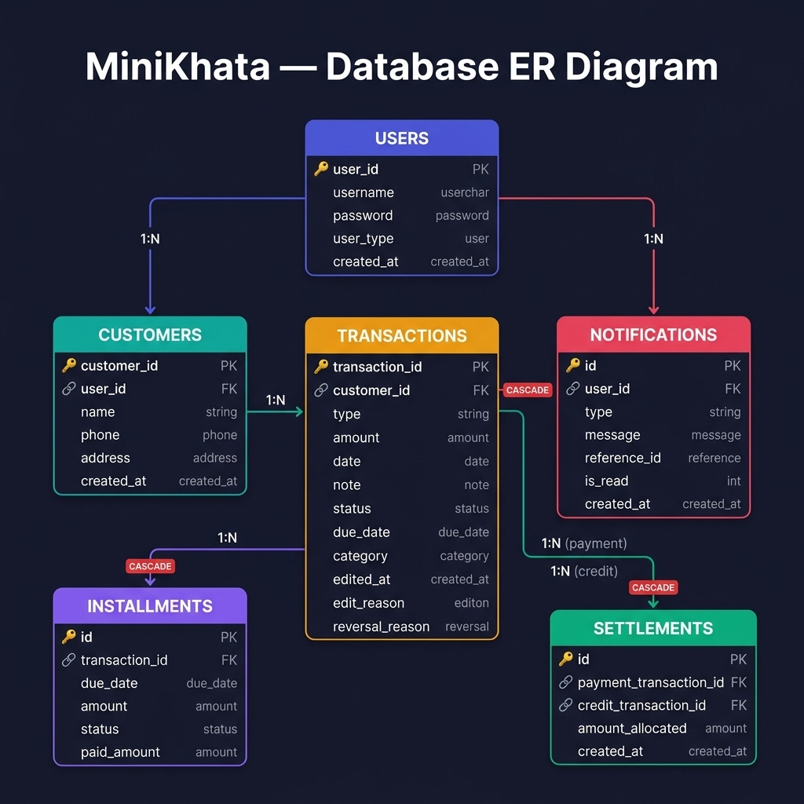
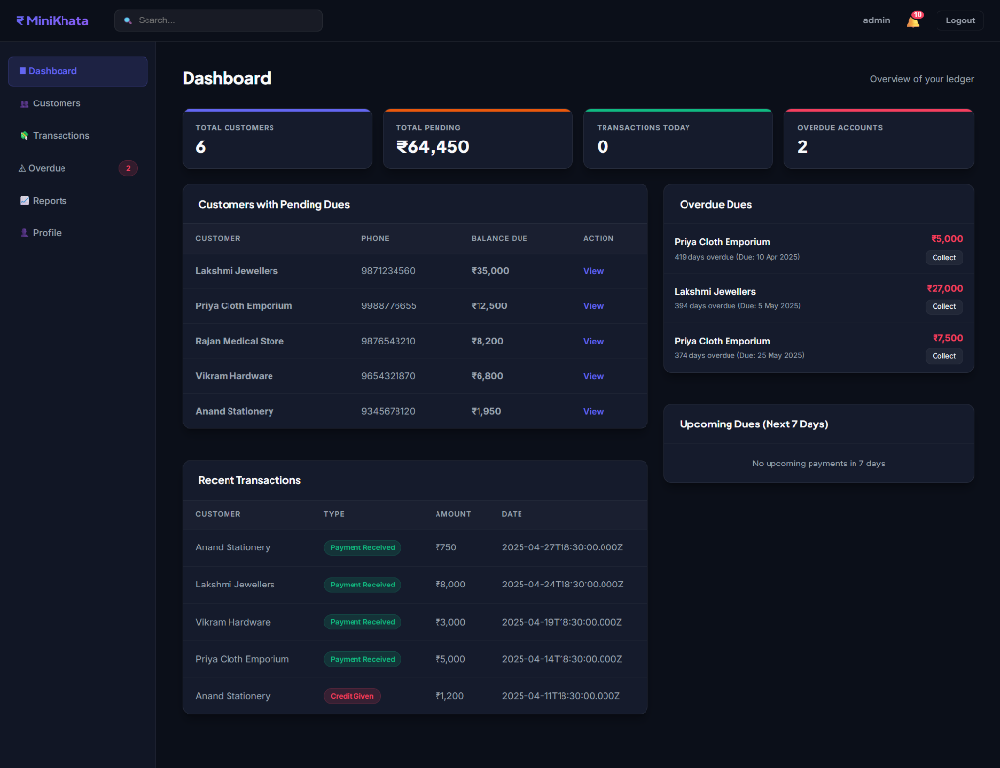
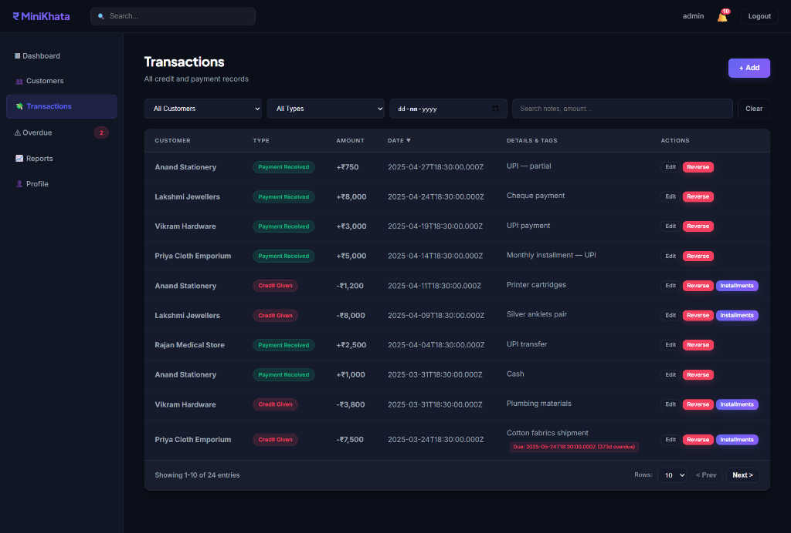
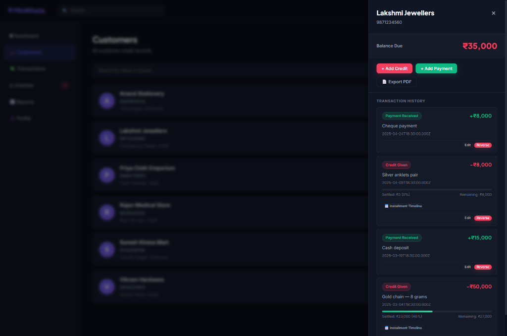
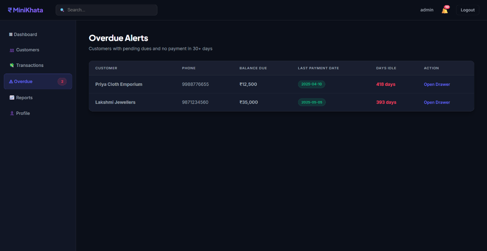
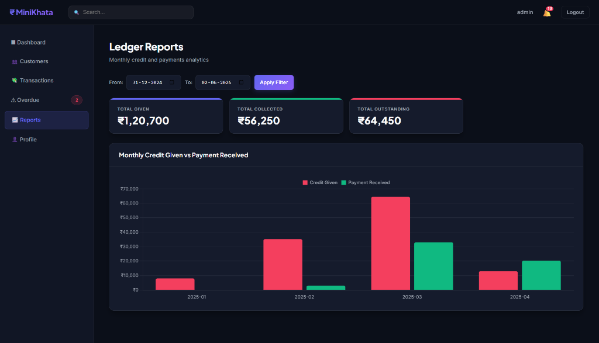
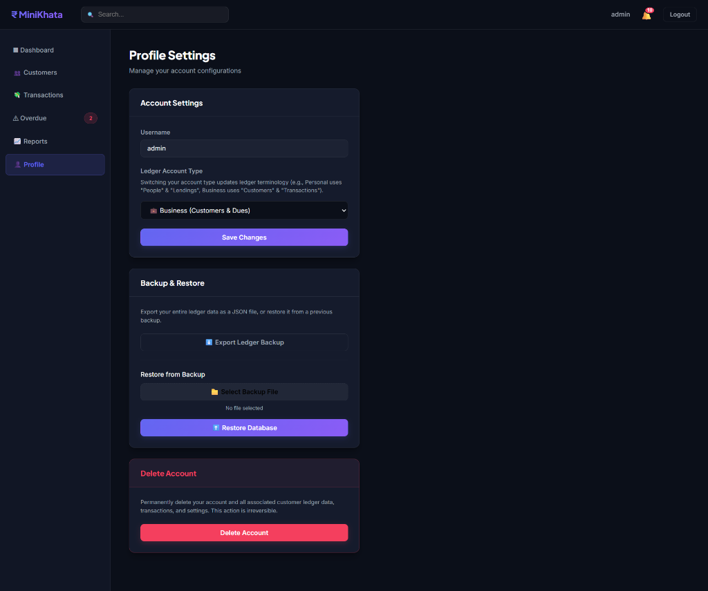

# MiniKhata — Project Submission Report

MiniKhata is a multi-user digital ledger application designed for small businesses and individuals to track financial transactions, manage customer credits (dues), handle installment timelines, and analyze overall ledger health. 

This report presents a complete overview of the system's architecture, key features, database schema, and active user interface modules.

---

## 🛠️ Technology Stack & Architecture

The application is built on a robust, lightweight, and modern stack focusing on performance, clean database structure, and rich UI feedback:

*   **Backend**: Node.js with Express.js for handling API routing, session management, and business logic.
*   **Database**: MySQL database storing normalized records across 6 related tables with foreign keys and cascading deletes.
*   **Frontend**: Vanilla HTML5, CSS3, and JavaScript, designed as a highly interactive dashboard using modern CSS principles (CSS custom properties, glassmorphism, responsive flex layouts, and active status indicators).
*   **Key Algorithms**:
    *   **FIFO Settlement Engine**: Automatically allocates incoming payments to outstanding credits in first-in, first-out order to track exactly which dues are settled or partially remaining.
    *   **Installment Planner**: Tracks specific due dates for large transactions and flags overdue elements.
    *   **Notification Engine**: Evaluates ledger state (e.g., unpaid dues > 30 days) and generates smart alerts for users.

---

## 📊 Database Schema & ER Diagram

The database structure consists of 6 primary entities linked via robust relationships:

1.  **`users`**: Manages secure credentials and account types (Business or Personal).
2.  **`customers`**: Holds client contact details linked to the respective owner account.
3.  **`transactions`**: Stores credit transactions and payments.
4.  **`settlements`**: Maps payments to specific credits using the FIFO algorithm.
5.  **`installments`**: Tracks payment schedules for specific credit events.
6.  **`notifications`**: Powers the dynamic alert system.

---

## 🖥️ System Interface Walkthrough

Below are screenshots capturing the system's live features and modules running on a seeded dataset:

### 1. Unified Dashboard
The Dashboard gives an immediate bird's-eye view of your outstanding balances, customer count, today's transactions, and a list of overdue accounts.
*   **Key Indicators**: Clean metric cards displaying Total Customers, Total Pending (dues), Today's Activity, and Overdue Accounts.
*   **Quick Views**: Summarized tables for quick access to customer drawers and recent ledger modifications.

---

### 2. Transaction Management Ledger
The Transactions page lists all financial activities with precise filters by customer, transaction type (Credit vs Payment), date range, and note search.
*   **Aesthetic Badges**: Visual indicators distinguish Credit Given (red with `-` sign) from Payment Received (green with `+` sign).
*   **Interactivity**: Each record features quick action buttons to edit details, reverse a transaction with audit notes, or view scheduled installments.

---

### 3. Customer Account Drawer & History
Clicking on any customer slides open an interactive side-drawer displaying their specific balances and settlement history.
*   **Progressive Settlement Tracking**: Clearly shows the percentage of credit settled for each purchase (e.g., *"Settled: ₹23,000 (46%)"*).
*   **PDF Statements**: Generates print-ready ledger reports for instant download or sharing.

---

### 4. Overdue Alerts Engine
The Overdue page aggregates customers with idle balances that haven't received a payment in over 30 days.
*   **Dynamic Idle Counter**: Displays the exact number of days a ledger has been inactive (e.g., *"418 days idle"* in red text).
*   **Quick Action**: Allows direct entry into the customer's drawer to set up installments or log payments.

---

### 5. Ledger Reports & Monthly Analytics
The Reports tab plots Credit Given against Payment Received on a monthly bar chart.
*   **Date Filters**: Allows custom range selections to dynamically update chart visualizations.
*   **High-contrast Charts**: Distinct colors provide immediate visual feedback on cash flow trends.

---

### 6. Profile Settings & Dynamic Terminology Switching
The Profile page enables users to customize application behavior, switch modes, and backup database states.
*   **Dynamic Terminology**: Toggle between **Business mode** (Customers, Transactions, Credit Given, Payment Received) and **Personal mode** (People, Lendings, Lent, Paid Back). The entire UI terminology updates dynamically without reloading!
*   **Data Backup & Restore**: Instantly exports the database state to a JSON file or restores it, ensuring data safety.

---

> [!NOTE]
> All interface actions are fully authenticated. System operations are running live locally at `http://localhost:3000` with simulated datasets covering multi-month business transactions.
